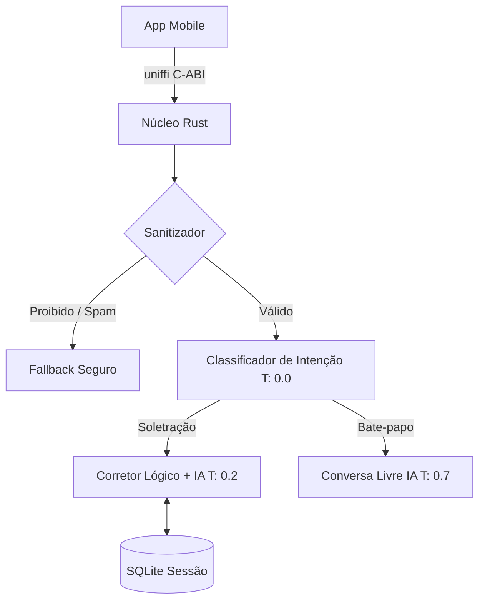

<div align="center">
  <h1>🚀 ChildAssist - Edge AI Literacy Core</h1>
  <p>
    <strong>Núcleo de Inteligência Artificial Local em Rust para Aplicativos de Alfabetização Infantil</strong>
  </p>
  <p>
    
    
    
    
  </p>
</div>

---

## 📖 Sobre o Projeto

O **ChildAssist** é um núcleo de alta performance construído nativamente em **Rust**. Ele foi projetado para atuar como o cérebro de inteligência artificial de aplicativos mobile focados na alfabetização de crianças, operando 100% offline (Edge AI) através de integração cruzada utilizando `uniffi` (Kotlin e Swift).

O sistema roteia interações, corrige soletrações de forma lúdica e mantém um bate-papo encorajador, blindado contra palavras inapropriadas e comportamentos de spam — tudo de forma local, preservando a privacidade das crianças.

## ✨ Arquitetura e Funcionalidades

- 🧠 **Motor de IA Flexível**: Integração nativa projetada para `llama.cpp` (produção mobile) e suporte a APIs locais (como Ollama) para ambiente de desenvolvimento.
- 🛡️ **Sanitização de Borda**: Filtro nativo de alta velocidade usando Expressões Regulares (Regex) e cache de bloqueio antes de qualquer gasto de processamento de LLM.
- 🌡️ **Temperatura Dinâmica**: Roteamento lógico estrito (0.0), correção pedagógica equilibrada (0.2) e conversas criativas flexíveis (0.7).
- 🧩 **100% Externalizado**: Sem regras hardcoded. Todos os prompts, personas e fluxos são definidos e injetados via `prompts.json`.
- 💾 **Memória Segura e Persistente**: Banco de dados SQLite (`rusqlite`) embarcado, com controle de Mutex à prova de concorrência.
- 🌉 **Uniffi Scaffolding**: Geração automática de bibliotecas C-ABI nativas para injeção limpa no Xcode e Android Studio.

## 🏗️ Como a Engenharia Funciona



## 🛠️ Começando (Desenvolvimento Local)

### Pré-requisitos
- [Rust Toolchain](https://rustup.rs/) instalada (`rustc`, `cargo`).
- [Ollama](https://ollama.com/) instalado na máquina (para simulação).

### Instalação e Testes

1. Baixe o modelo primário para testes de desenvolvimento (Ollama no background):
   ```bash
   ollama pull qwen2.5:3b
   ```

2. Clone o repositório e compile:
   ```bash
   git clone https://github.com/mjlelis/childassist.git
   cd childassist
   cargo build
   ```

3. Execute os testes garantindo que o Linter e Formatador estejam no padrão:
   ```bash
   cargo fmt --check
   cargo clippy -- -D warnings
   cargo check
   ```

## 📦 Gerando Bibliotecas Mobile (Entrega)

Para compilar e gerar a ponte para Android (Kotlin) e iOS (Swift), utilizamos o utilitário do `uniffi`. Após compilar em modo `--release`, invoque o bindgen na biblioteca gerada.

```bash
cargo build --release
cargo run --bin uniffi-bindgen generate --library target/release/libprojeto_alfabetizacao_rust.so --language swift --out-dir out/
```

## 🤝 Como Contribuir

Ficamos felizes em aceitar colaborações para melhorar o ChildAssist!
Por favor, leia nosso [CONTRIBUTING.md](./CONTRIBUTING.md) para detalhes sobre o nosso processo de submissão de Pull Requests. Utilizamos **Conventional Commits** e mantemos os mais altos padrões de código seguro (Safe Rust).

## 📄 Licença

Este projeto está sob licença apropriada. Consulte os administradores do repositório para detalhes sobre distribuição comercial mobile.
